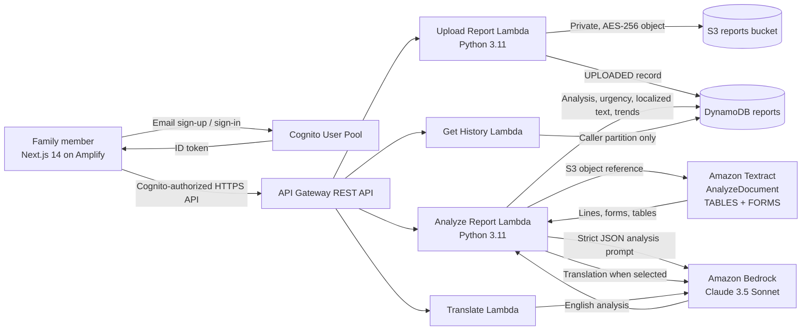

# 🏥 MedBridge

> **Mummy ki Report Samjho — without the Google panic.**

MedBridge is a private, AI-assisted interpreter for Indian lab reports. A family member uploads a JPG or PNG from Dr. Lal PathLabs, Thyrocare, SRL, or a local laboratory; MedBridge reads the report with Amazon Textract, explains each result in calm language with Amazon Bedrock, and retains comparable values for future trend views.

It is built as a deployable AWS hackathon project with **Next.js 14, AWS SAM, Lambda (Python 3.11), API Gateway, Cognito, S3, DynamoDB, Textract, Bedrock Claude 3.5 Sonnet, and Amplify Hosting**.

> **Medical safety:** MedBridge is an educational report explainer, not a diagnosis, prescription service, or emergency service. Always use the original report and a qualified clinician’s advice for health decisions. Seek urgent in-person care for severe or rapidly worsening symptoms.

---

## What it does

- **Secure image upload:** accepts a clear JPG/PNG lab-report image up to 7 MiB, validates its bytes, and saves it in a private encrypted S3 bucket.
- **Indian report-aware OCR:** Amazon Textract `AnalyzeDocument` extracts `TABLES`, `FORMS`, and ordered `LINE` blocks.
- **Careful AI interpretation:** Claude receives the structured OCR output and returns strict JSON for patient information, every readable result, lab reference ranges, colour status, summary, urgency, recommendations, and disclaimer.
- **Clear statuses:** 🟢 Normal, 🟡 Borderline, 🔴 Critical. The analysis prompt prioritizes the range printed by the laboratory and is intentionally conservative about urgency.
- **Seven language choices:** English, हिंदी, தமிழ், తెలుగు, ಕನ್ನಡ, বাংলা, and मराठी. A second Bedrock call localizes the summary, recommendations, disclaimer, and trend wording while preserving numbers and test abbreviations.
- **Longitudinal trends:** a new analysis compares matching tests with compatible units against the most recent completed report. It describes the numerical change without asserting a cause or treatment outcome.
- **Private history:** API Gateway is protected by Cognito. Each Lambda gets the Cognito `sub` from the authorizer and only accesses that user’s DynamoDB partition.
- **Elderly-friendly web UI:** large controls, high-contrast status cards, mobile responsiveness, drag-and-drop upload, image preview, visible urgency guidance, and readable results tables.

---

## Architecture



### Data flow

1. The browser signs in with Cognito and sends the fresh **ID token** in its `Authorization: Bearer` header.
2. `POST /reports` validates a base64 JPEG/PNG, puts it under a user-specific private S3 prefix, and creates an `UPLOADED` DynamoDB item.
3. `POST /reports/{reportId}/analyze` confirms ownership, asks Textract to read the S3 object, serializes tables/forms/lines, and sends only that document text to Bedrock.
4. Claude returns validated English JSON. If a vernacular language is selected, Claude makes a second, constrained translation call. The canonical English analysis and compact localized display fields are saved in DynamoDB.
5. The history Lambda queries only `PK = userId`; report IDs are time-sortable so the newest report appears first.

---

## Repository layout

```text
MedBridge/
├── README.md
├── backend/
│   ├── template.yaml
│   ├── samconfig.toml
│   └── functions/
│       ├── upload-report/
│       │   ├── handler.py
│       │   └── requirements.txt
│       ├── analyze-report/
│       │   ├── handler.py
│       │   └── requirements.txt
│       ├── get-history/
│       │   ├── handler.py
│       │   └── requirements.txt
│       └── translate/
│           ├── handler.py
│           └── requirements.txt
├── frontend/
│   ├── amplify.yml
│   ├── package.json
│   ├── next.config.js
│   ├── tailwind.config.js
│   ├── tsconfig.json
│   ├── .env.example
│   └── src/
│       ├── app/
│       │   ├── layout.tsx
│       │   ├── globals.css
│       │   ├── page.tsx
│       │   ├── upload/page.tsx
│       │   └── history/page.tsx
│       ├── components/
│       └── lib/
└── scripts/
    └── deploy.sh
```

---

## AWS resources provisioned by SAM

`backend/template.yaml` creates the following resources in the configured AWS Region:

| Resource | Purpose |
| --- | --- |
| Private S3 bucket | Versioned, server-side-encrypted original report images; public access is fully blocked; CORS is included for future browser upload flows. |
| DynamoDB table | `PK=userId`, `SK=reportId`, on-demand billing, point-in-time recovery, encrypted storage, analysis JSON, statuses, urgency, timestamps, and compact localized fields. |
| Cognito User Pool + public web client | Email username, mandatory email verification, strong password policy, revocable tokens, and anti-user-enumeration behavior. |
| API Gateway REST API | Regional HTTPS API, Cognito authorizer on all application routes, CORS, gateway error CORS responses, and X-Ray tracing. |
| Upload Lambda | Validates image type/size, writes the private S3 object, and creates the report record. |
| Analyze Lambda | Calls Textract and Bedrock, validates model JSON, computes safe numerical trends, localizes display content, and persists the result. |
| History Lambda | Returns paginated report summaries and trends from only the authenticated person’s partition. |
| Translate Lambda | Exposes a constrained, authenticated Bedrock translation endpoint for approved summary content. |

CloudFormation exports `ApiUrl`, `UserPoolId`, `ClientId`, `BucketName`, and `ReportsTableName`.

---

## Prerequisites

Install and authenticate these tools before deployment:

- Node.js **18.17+** and npm
- Python **3.11**
- AWS CLI v2, authenticated to an AWS account allowed to create the resources above
- AWS SAM CLI
- Amplify CLI (`npm install -g @aws-amplify/cli`) or a working `npx`
- Amazon Bedrock model access for `anthropic.claude-3-5-sonnet-20241022-v2:0` in the deployment Region

The included `samconfig.toml` defaults to `ap-south-1`. If that Region does not offer the selected model for your account, choose a Region where it is available and deploy with `AWS_REGION` set to that Region. Model access must be enabled in the Bedrock console before the first analysis request.

---

## Deploy the backend

### 1. Validate and build

```bash
cd backend
sam validate --lint
sam build
```

### 2. Deploy the SAM stack

The default stack is named `medbridge`, uses stage `prod`, and creates unique physical names for the S3 bucket and DynamoDB table.

```bash
sam deploy --config-file samconfig.toml --config-env default
```

For an unattended deploy, use the project script described below. SAM needs `CAPABILITY_IAM` because it creates Lambda execution roles.

### 3. Read the generated client settings

```bash
aws cloudformation describe-stacks \
  --stack-name medbridge \
  --region ap-south-1 \
  --query 'Stacks[0].Outputs[].[OutputKey,OutputValue]' \
  --output table
```

The output values map directly to the four variables in `frontend/.env.example`:

```dotenv
NEXT_PUBLIC_AWS_REGION=ap-south-1
NEXT_PUBLIC_API_URL=ApiUrl output
NEXT_PUBLIC_COGNITO_USER_POOL_ID=UserPoolId output
NEXT_PUBLIC_COGNITO_USER_POOL_CLIENT_ID=ClientId output
```

The `NEXT_PUBLIC_` values are browser configuration identifiers, not AWS secrets. Do not place AWS access keys, Cognito user passwords, Bedrock credentials, or S3 credentials in the frontend environment.

---

## Run the frontend locally

```bash
cd frontend
cp .env.example .env.local
npm install
npm run dev
```

Update `.env.local` with the actual CloudFormation outputs before trying sign-in or upload. The development server binds to `0.0.0.0`, which is suitable for a remote workspace preview. The browser always calls the configured HTTPS API URL; it never calls a backend on `localhost`.

Then open the displayed Next.js address. Create an account with an email address, enter the Cognito verification code, sign in, and upload a clear JPG or PNG report.

Quality checks:

```bash
cd frontend
npm run typecheck
npm run build
```

---

## Publish with AWS Amplify

Connect the repository to an Amplify Hosting app with `frontend` set as the app root. Amplify uses `frontend/amplify.yml`, runs `npm ci`, runs `npm run build`, and publishes `.next`. For a Git-connected Amplify app, add the four `NEXT_PUBLIC_` values from the SAM outputs as Amplify environment variables before the first build.

For an Amplify CLI-managed hosting project, initialize hosting once from `frontend`:

```bash
cd frontend
amplify init
amplify add hosting
```

After Amplify gives you its production URL, redeploy SAM with a narrow CORS origin instead of `*`:

```bash
MEDBRIDGE_ALLOWED_ORIGIN=https://main.example.amplifyapp.com scripts/deploy.sh
```

The repository’s complete deployment command is:

```bash
scripts/deploy.sh
```

It performs `sam build`, `sam deploy`, reads the four CloudFormation outputs, writes an ignored `frontend/.env.production`, and finally runs `amplify publish`. The command supports these optional environment settings:

| Variable | Default | Use |
| --- | --- | --- |
| `AWS_REGION` | `ap-south-1` | AWS Region for SAM and CloudFormation output lookup. |
| `MEDBRIDGE_STACK_NAME` | `medbridge` | CloudFormation stack name. |
| `MEDBRIDGE_PROJECT_NAME` | `medbridge` | Lowercase resource naming prefix. |
| `MEDBRIDGE_STAGE` | `prod` | API stage. |
| `MEDBRIDGE_ALLOWED_ORIGIN` | `*` | Exact Amplify browser origin for CORS hardening. |
| `MEDBRIDGE_BEDROCK_MODEL_ID` | Claude 3.5 Sonnet model ID | A Bedrock model enabled in the chosen Region. |
| `MEDBRIDGE_MAX_IMAGE_BYTES` | `7340032` | Maximum decoded image size. |
| `MEDBRIDGE_CONFIRM_CHANGES` | `false` | Set to `true` to review the SAM changeset interactively. |

If no global Amplify CLI is installed, the script invokes `npx --yes @aws-amplify/cli@latest publish`.

---

## API contract

All API routes require a verified Cognito user and an `Authorization: Bearer {idToken}` header.

### `POST /reports`

```json
{
  "fileName": "blood-report.jpg",
  "contentType": "image/jpeg",
  "imageBase64": "base64 image bytes without the data URL prefix"
}
```

Returns a time-sortable `reportId` and `UPLOADED` status. The S3 object key is never returned to the browser.

### `POST /reports/{reportId}/analyze`

```json
{
  "language": "hi"
}
```

Allowed language codes: `en`, `hi`, `ta`, `te`, `kn`, `bn`, `mr`.

Returns the strict analysis object:

```json
{
  "patient_info": {
    "name": "string",
    "age": "string",
    "sex": "string",
    "lab_name": "string",
    "report_date": "string"
  },
  "results": [
    {
      "test_name": "string",
      "value": "string",
      "unit": "string",
      "reference_range": "string",
      "status": "NORMAL | BORDERLINE | CRITICAL",
      "explanation": "string"
    }
  ],
  "summary": "string",
  "urgency": "ROUTINE | SEE_DOCTOR_SOON | URGENT",
  "recommendations": ["string"],
  "disclaimer": "string",
  "trends": ["safe numerical comparison objects"]
}
```

A later request for the same report in a different language reuses the canonical analysis and only runs the localization call; it does not pay to run Textract again.

### `GET /reports?limit=20&nextToken=...`

Returns the caller’s reports from newest to oldest. `limit` is 1–50. The opaque `nextToken` is constrained to the same Cognito user partition.

### `POST /translate`

Accepts either `{"language":"ta","text":"..."}` or an approved structured `content` object containing summary fields. It does not persist the request.

---

## Safety and privacy decisions

- **No public report URLs:** S3 public access is blocked and objects are saved under an authenticated user-specific prefix.
- **Least privilege per function:** upload has S3 write + DynamoDB access, history has DynamoDB read only, and only analysis has Textract/S3 read/Bedrock access.
- **Ownership is server-enforced:** a report key always includes the Cognito authorizer’s `sub`; callers cannot submit a user ID or retrieve another partition.
- **No raw OCR stored in DynamoDB:** the analysis Lambda uses OCR in memory, stores the structured analysis needed for history, and does not log report text or patient details.
- **Conservative report logic:** printed lab ranges are treated as primary; fallback Indian convention examples are only orientation when no lab interval is visible. Unclear values are kept unclear rather than invented.
- **Non-causal trends:** MedBridge says a value rose, fell, or was unchanged. It never asserts that a medicine worked or caused a change.
- **Operational retention:** the S3 bucket and DynamoDB table use `Retain` on stack deletion to avoid accidental health-data deletion. Establish an organization-approved retention and deletion process before production use.

---

## Team credits

**Team MedBridge**

- **Sudhanshu Rai** — product concept, full-stack engineering, and AWS hackathon implementation
- Built with AWS SAM, Amazon Textract, Amazon Bedrock, Amazon Cognito, Amazon S3, Amazon DynamoDB, API Gateway, and AWS Amplify

---

## License and responsible use

This repository is intended for hackathon and educational use. Before handling real patient data in a production setting, complete an appropriate security review, establish consent and retention policies, verify regional compliance obligations, configure a restricted CORS origin, and obtain clinical review of the prompt and user-facing language.
