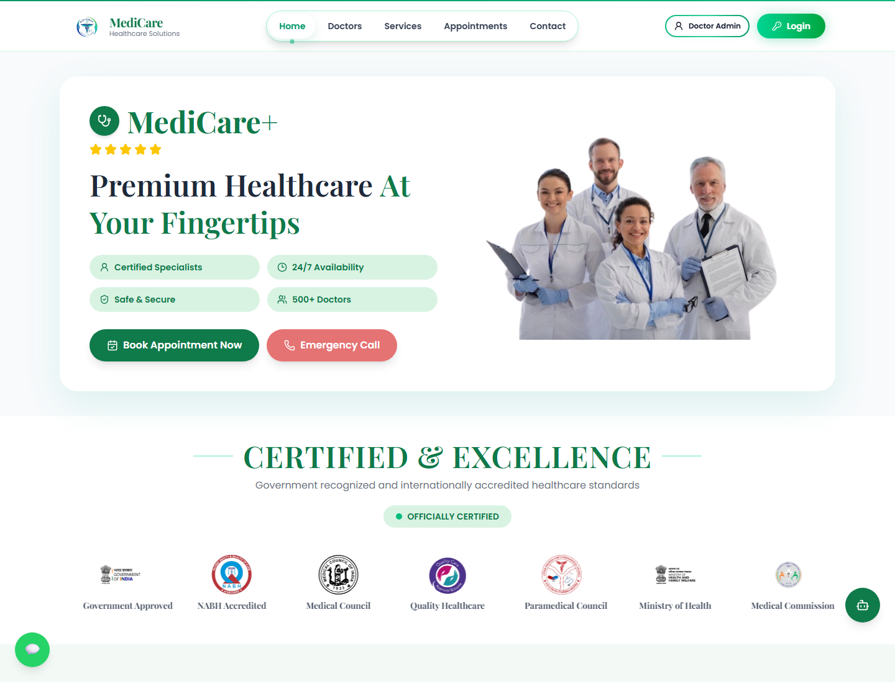
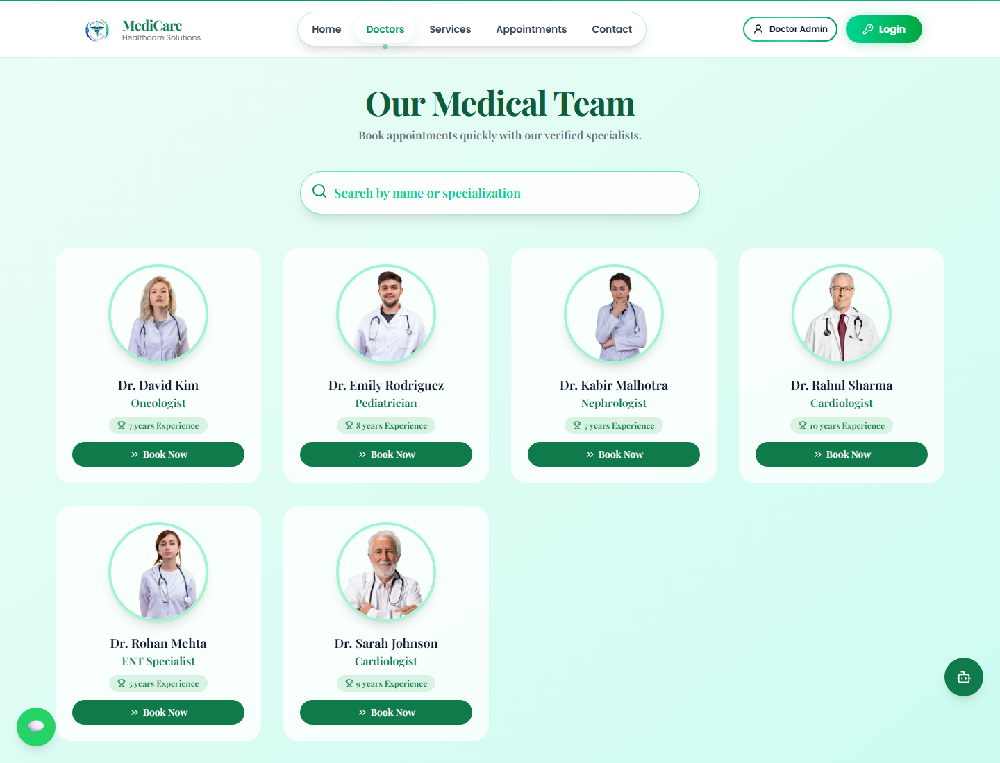
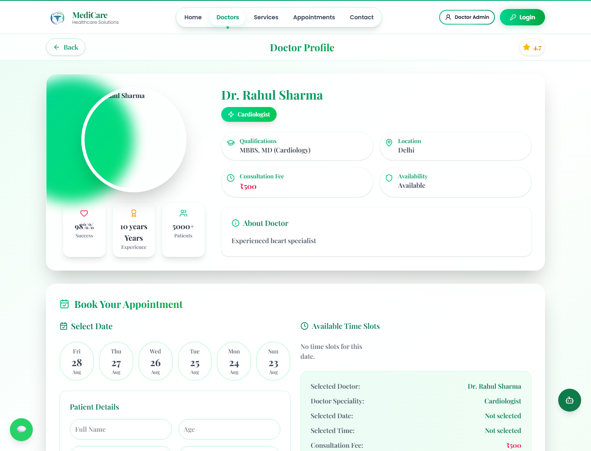
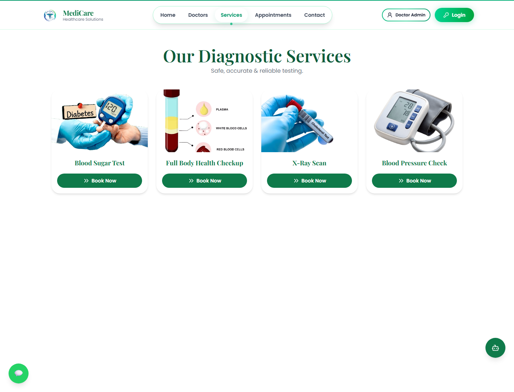
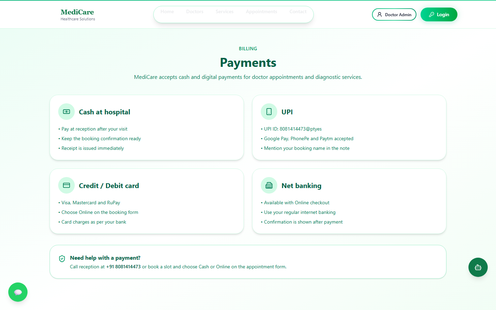
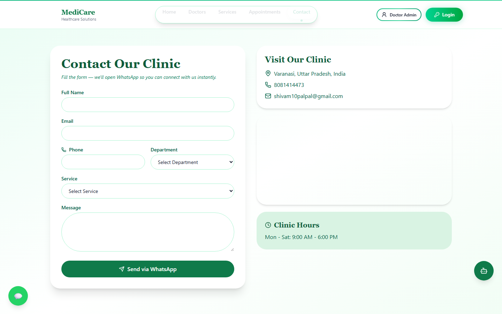
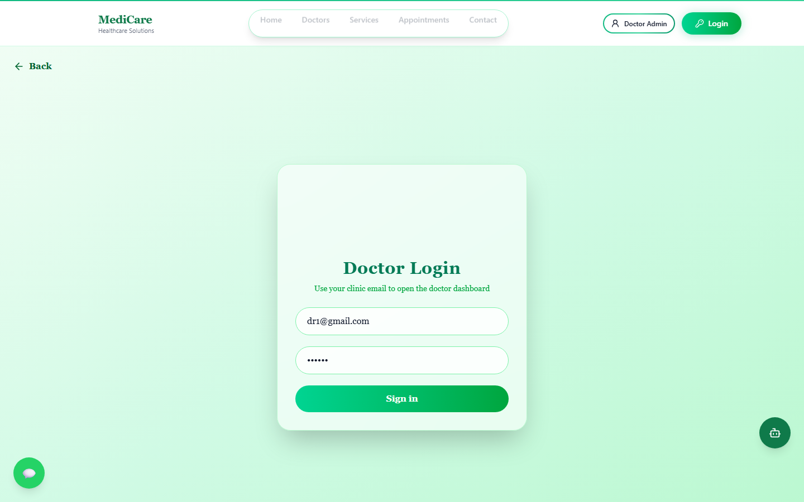

<p align="center">
  
</p>

<h1 align="center">MediCare</h1>

<p align="center">
  Live hospital appointment platform — book a doctor, pay, and get clinic guidance in one place.
</p>

<p align="center">
  <a href="https://medi-care-two-blush.vercel.app"></a>
  <a href="https://github.com/Shivampal157/MediCare"></a>
  <a href="https://medicare-api-36hv.onrender.com/api/health"></a>
</p>

<p align="center">
  
  
  
  
  
  
  
  
</p>

<p align="center">
  
</p>

---

## Why this project

Patients still book clinics on phone and WhatsApp. MediCare is a **live** patient site + doctor dashboard + admin panel:

- Pick a specialist or lab test
- Choose a slot
- Pay by cash or UPI / card
- Ask the Gemini assistant which department to visit (no diagnosis, no medicine)

| | |
| --- | --- |
| **Live** | [medi-care-two-blush.vercel.app](https://medi-care-two-blush.vercel.app) |
| **API** | [medicare-api-36hv.onrender.com](https://medicare-api-36hv.onrender.com/api/health) |
| **Clinic** | Varanasi, Uttar Pradesh |

---

## Product tour

### Homepage

Hero, certifications, and a one-click path to booking. WhatsApp and the green **MediCare AI** button stay on every public page.

<p align="center">
  
</p>

### Find a doctor

Search by name or specialization. Each card opens a profile with fee, availability, and **Book Now**.

<p align="center">
  
</p>

### Doctor profile and booking

Qualifications, fee, success stats, date picker, patient form, and a live booking summary.

<p align="center">
  
</p>

### Diagnostic services

Blood sugar, full-body checkup, X-ray, BP check — same booking flow as doctors.

<p align="center">
  
</p>

### Payments

Cash at hospital, UPI, cards, and net banking. UPI ID is shown on the site.

<p align="center">
  
</p>

### Contact

Form opens WhatsApp with the clinic. Address, phone, email, and hours on the right.

<p align="center">
  
</p>

### Doctor login

Separate dashboard for appointments and profile. Demo: `dr1@gmail.com` / `123456`.

<p align="center">
  
</p>

---

## What you can do in the app

| Role | Features |
| --- | --- |
| **Patient** | Google sign-in, browse doctors & tests, book slot, cash or online pay, Gemini chat, WhatsApp |
| **Doctor** | JWT login, appointment list, edit profile / fees / availability |
| **Admin** | Add / edit doctors and diagnostic services (local admin app on port `5174`) |

**AI assistant (bottom-right)**

- Hindi or English
- Suggests a specialty or lab test from symptoms
- Does **not** diagnose or prescribe
- Emergency language → call **108**
- Uses live doctor and service lists from MongoDB
- Rate limited (20 requests / 10 minutes / IP)

---

## Architecture

```text
  Patient site (Vite / React)          Doctor panel          Admin (Vite)
           |                                  |                    |
           +--------------- HTTPS REST -------------------------+
                                      |
                              Express API (:4000)
                                      |
           +------------+------------+-------------+------------+
           |            |            |             |            |
      MongoDB      Google GIS    Gemini       Stripe      Cloudinary
       Atlas       (patients)    chat        Checkout      images
```

**Hosting:** frontend on **Vercel**, API on **Render**, database on **MongoDB Atlas**.

---

## Tech stack

| Layer | Choice |
| --- | --- |
| Frontend | React, Vite, Tailwind CSS |
| Backend | Node.js, Express |
| Database | MongoDB Atlas + Mongoose |
| Auth | Google Sign-In (patients), bcrypt + JWT (doctors) |
| Payments | Cash path; Stripe Checkout when `STRIPE_SECRET_KEY` is set |
| AI | Google Gemini (`GEMINI_API_KEY`) |
| Images | Cloudinary (optional) + local uploads |
| Deploy | Vercel + Render |

---

## Demo login

| Role | How |
| --- | --- |
| Patient | **Continue with Google**, or `patient@gmail.com` / `123456` |
| Doctor | `dr1@gmail.com` / `123456` then `/doctor-admin` |
| Sample service | Full Body Health Checkup |

Doctor panel: `/login` → `/doctor-admin`. Admin app: `http://localhost:5174`.

> Render free tier sleeps after idle time. The first API request can take 30–60 seconds.

---

## Run locally

```bash
cp backend/.env.example backend/.env
cp frontend/.env.example frontend/.env
```

Set `MONGODB_URI` in `backend/.env` (Atlas). If local Mongo is down, development can fall back to an in-memory database.

```bash
# API  →  http://localhost:4000
cd backend && npm install && npm run dev

# Patient site  →  http://localhost:5173
cd frontend && npm install && npm run dev

# Admin (optional)  →  http://localhost:5174
cd admin && npm install && npm run dev
```

Health check: [http://localhost:4000/api/health](http://localhost:4000/api/health)

---

## Environment variables

**Backend** (`backend/.env`)

| Variable | Purpose |
| --- | --- |
| `MONGODB_URI` | Atlas URI (`.../medicare`) |
| `JWT_SECRET` | Doctor JWT signing |
| `FRONTEND_URL` | Patient origin (CORS + Stripe redirects) |
| `ADMIN_URL` | Admin origin (CORS) |
| `PORT` | Default `4000` (Render sets this) |
| `GEMINI_API_KEY` | MediCare AI chat |
| `GEMINI_MODEL` | Optional model override |

Optional: `STRIPE_SECRET_KEY`, Cloudinary keys.

**Frontend** (`frontend/.env`)

| Variable | Purpose |
| --- | --- |
| `VITE_API_URL` | Backend base URL |
| `VITE_GOOGLE_CLIENT_ID` | Google OAuth Web client ID |
| `VITE_PHONE` / `VITE_EMAIL` / `VITE_UPI_ID` / `VITE_LOCATION` | Clinic details on the site |

Never commit `.env` files. Use `.env.example` as the template. Do not put a Google client **secret** in the frontend.

---

## Deploy notes

Already live:

1. **API** — Render Blueprint (`render.yaml`, service `medicare-api`)
2. **Patient site** — Vercel, root directory `frontend` (SPA rewrite in `vercel.json`)
3. **AI** — `GEMINI_API_KEY` on Render

If the Vercel URL changes, update:

- Render `FRONTEND_URL`
- Google Cloud → Authorized JavaScript origins (`localhost:5173` + live URL)
- Google test users while the OAuth app is in Testing

Atlas Network Access must allow Render (commonly `0.0.0.0/0` on a student project).

---

## Author

**Shivam Pal** — IIIT Agartala, CSE  
[GitHub](https://github.com/Shivampal157) · [LinkedIn](https://www.linkedin.com/in/shivam-pal-677777301)
